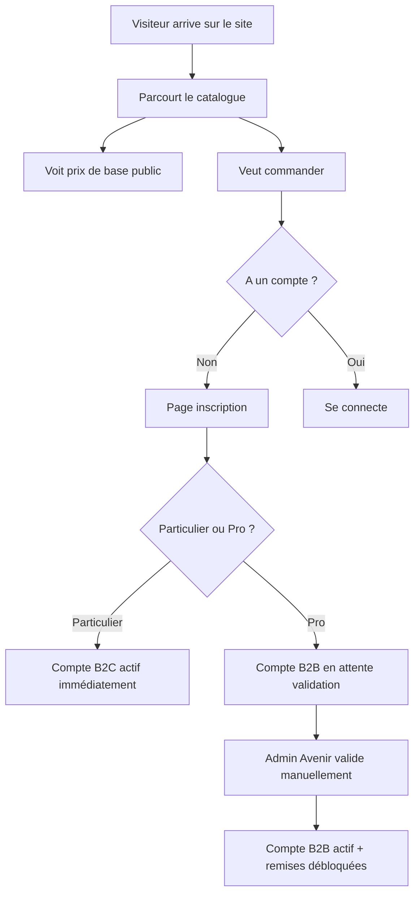
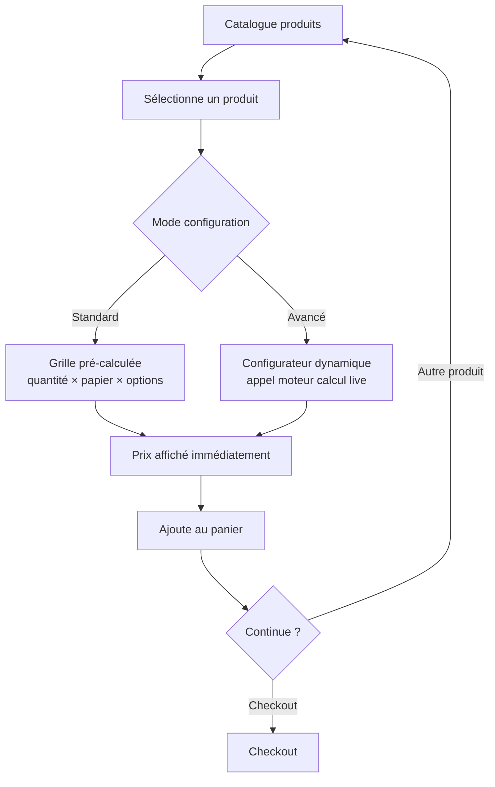
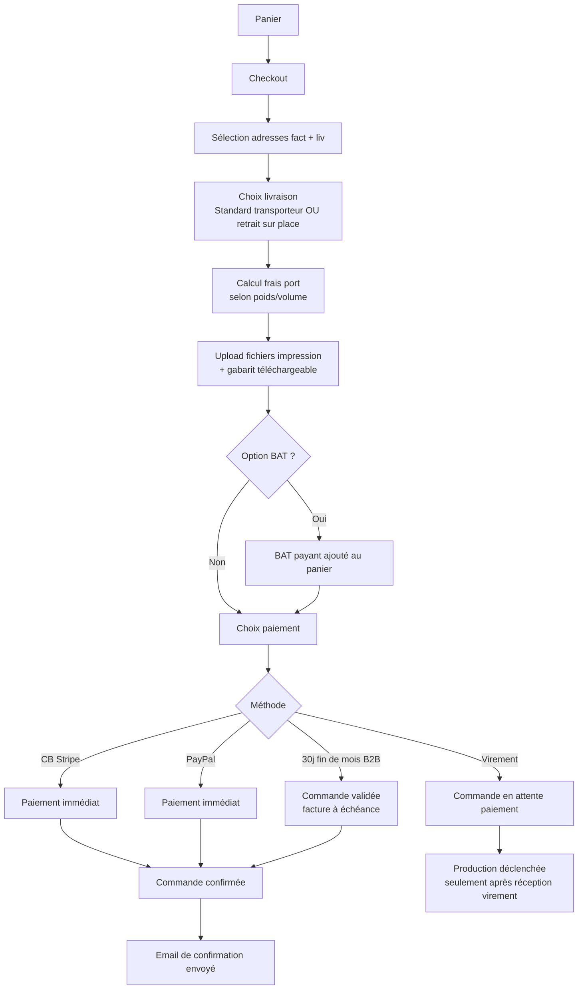
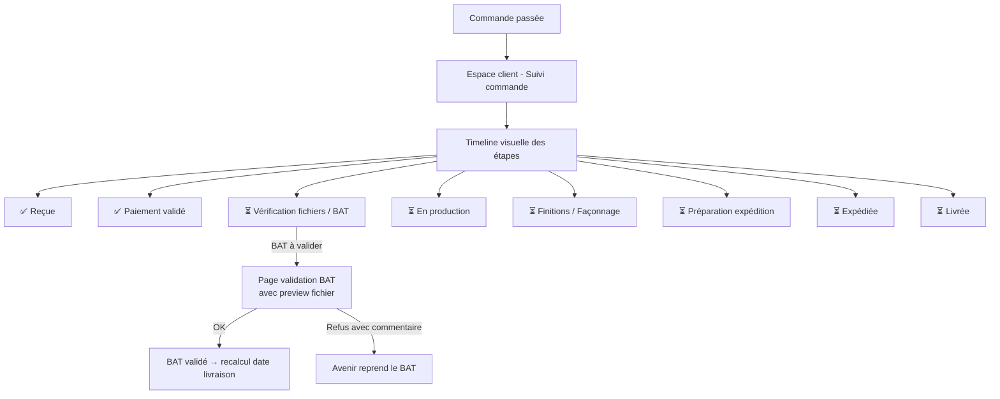
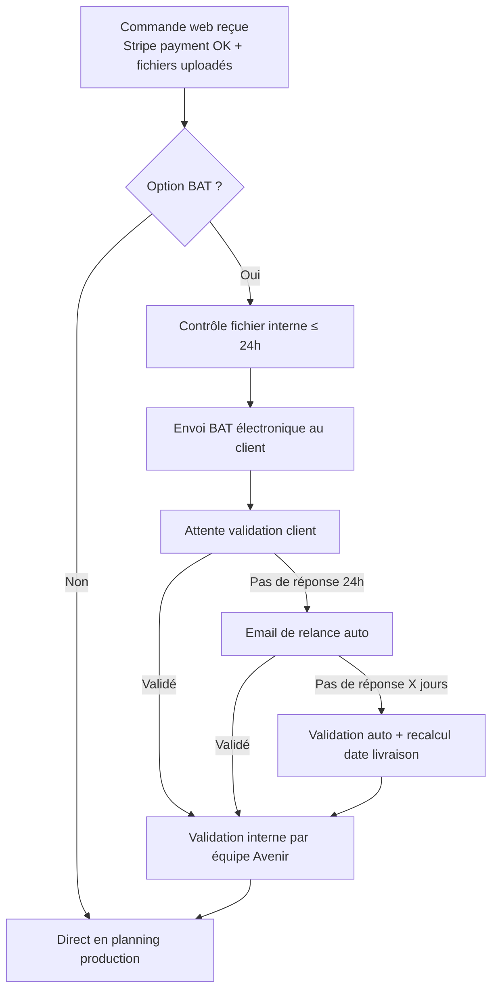
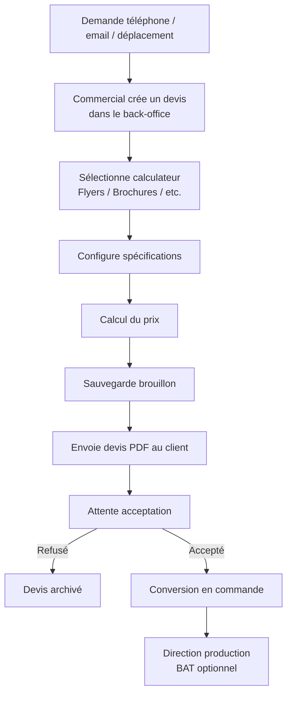
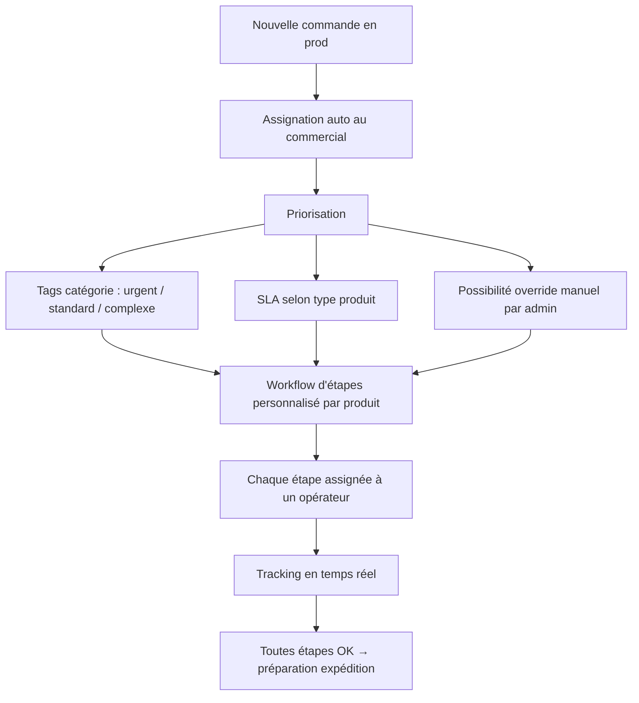
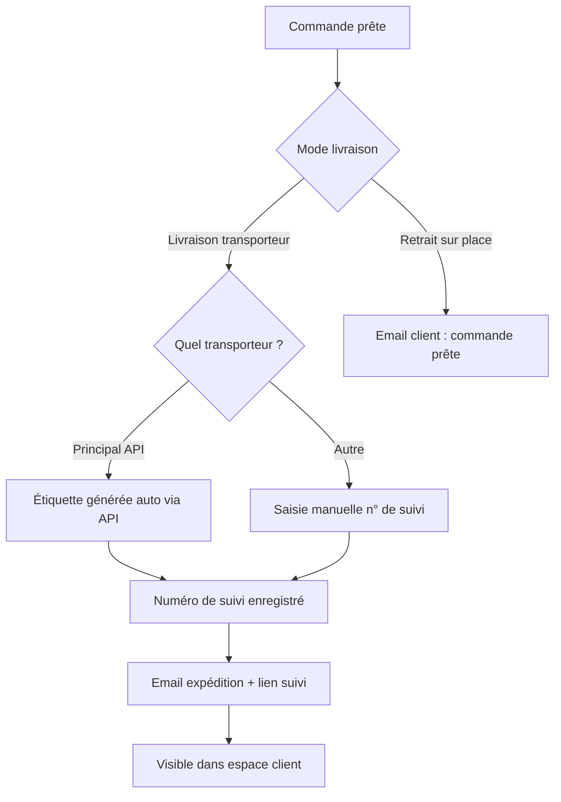
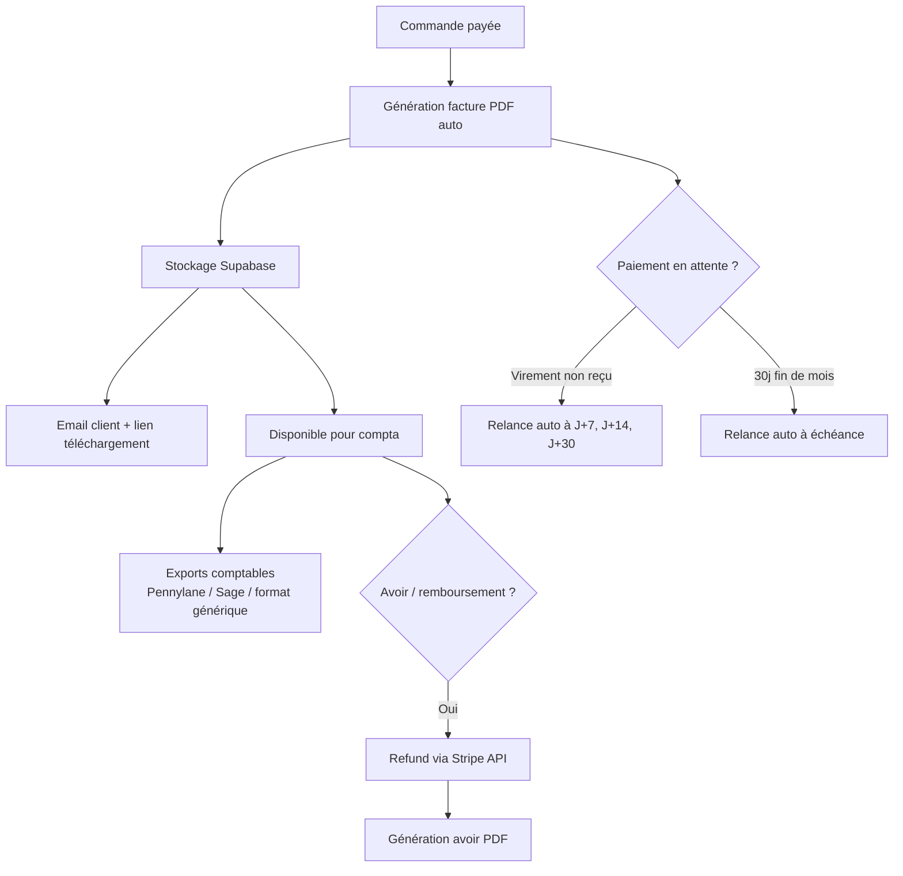

# 🔄 Workflows utilisateurs — Avenir Numérique

> **Document de référence — Parcours client e-commerce et parcours interne**  
> Version 1.0 — Mai 2026  
> Préparé pour la refonte technique du back-office et du site e-commerce

---

## Table des matières

1. [Acteurs](#1-acteurs)
2. [Parcours client e-commerce](#2-parcours-client-e-commerce)
3. [Parcours interne back-office](#3-parcours-interne-back-office)
4. [Workflows de production par produit](#4-workflows-de-production-par-produit)
5. [Notifications et communication](#5-notifications-et-communication)
6. [Permissions et rôles](#6-permissions-et-rôles)

---

## 1. Acteurs

### Côté client (site e-commerce public)

| Acteur | Description |
|---|---|
| **Visiteur** | Personne non connectée qui découvre le catalogue (prix de base visibles) |
| **Client B2C** | Compte particulier (validation auto à l'inscription) |
| **Client B2B** | Compte entreprise (SIRET demandé, validation manuelle Avenir, accès aux remises) |

### Côté Avenir Numérique (back-office)

| Acteur | Description |
|---|---|
| **Admin** | Florian — Accès total, gère utilisateurs, paramètres, marges, tarifs |
| **Commercial** | Maxime — Suit ses clients et commandes, calcule devis, valide BAT |
| **Opérateur prod** | Lance les impressions, marque les étapes terminées |
| **Façonneur** | Reliure, découpe, finitions |
| **Expédition** | Préparation colis, étiquettes, suivi transporteur |
| **Compta** | Factura, relances, exports comptables |

> Permissions **ultra-granulaires** : chaque action est protégée par une permission Supabase configurable par admin.

---

## 2. Parcours client e-commerce

### 2.1 Inscription / Connexion



**Champs inscription** :
- Particulier : email, mot de passe, nom, prénom
- Pro : + raison sociale, SIRET, TVA intra, contact, adresse facturation

### 2.2 Sélection produit



**Niveau d'autonomie** : grille pré-calculée pour 80% des cas (rapide), configurateur sur-mesure pour configurations atypiques (signal, format spécial).

### 2.3 Checkout / Commande



**Règles de paiement** :
- **CB + PayPal** : paiement immédiat obligatoire pour B2C et B2B sans compte spécial
- **Virement** : disponible pour B2B uniquement, production déclenchée à réception
- **30j fin de mois** : disponible pour B2B validés et configurés en backoffice

### 2.4 Suivi de commande client



### 2.5 Espace client (fonctionnalités)

- ✅ Historique des commandes + re-commande en 1 clic
- ✅ Carnet d'adresses (fact / liv) sauvegardées
- ✅ Téléchargement factures PDF
- ✅ Gestion BAT en cours
- ✅ Suivi temps réel avec timeline
- ✅ Téléchargement des gabarits

### 2.6 Fonctionnalités marketing prévues

- 🎯 Module avis clients (étoiles + commentaires)
- 🎯 Programme de fidélité / parrainage
- 🎯 Codes promo / bons de réduction
- 🎯 Chat / support en ligne
- 🎯 Newsletter

---

## 3. Parcours interne back-office

### 3.1 Réception d'une commande web



**Règle BAT clé** : à chaque validation tardive, la **date de livraison est recalculée** automatiquement à partir de la date de validation effective.

### 3.2 Création manuelle d'un devis (commande hors site)



### 3.3 Workflow production (orchestration)



**Priorisation** : combinaison des 3 méthodes (tags + SLA + override manuel).

### 3.4 Expédition



### 3.5 Facturation interne (module dédié)



### 3.6 Reporting / statistiques

**Tableaux de bord disponibles** :
- 📊 **Ventes & CA** : par jour / semaine / mois / année
- 📊 **Produits** : top vendus, panier moyen, taux conversion configurateur
- 📊 **Commercial** : ventes par commercial, taux validation devis, temps moyen de réponse
- 📊 **Client** : nouveaux vs récurrents, top clients par CA, taux d'attrition
- 📊 **Compta** : TVA collectée, CA HT, exports formats standards
- 📊 **Production** : délais moyens, retards, capacité utilisée par machine

---

## 4. Workflows de production par produit

Chaque type de produit a son **workflow d'étapes personnalisable**. Voici les workflows types :

### 4.1 Roll-up

```
1. Réception fichier client
2. Préparation BAT électronique (si option)
3. Validation BAT (client + interne)
4. Impression Epson solvant
5. Assemblage structure
6. Conditionnement (sac + scratchs inclus)
7. Préparation expédition
8. Expédition / retrait
```

### 4.2 Plaques

```
1. Réception fichier client + BAT
2. Validation BAT
3. Impression Mutoh UV LED
4. Découpe Zund (forme ou pleine plaque)
5. Pose finitions (œillets, supports, vernis, etc.)
6. Conditionnement
7. Expédition
```

### 4.3 Flyers / Affiches

```
1. Réception fichier client + BAT
2. Validation BAT
3. Impression (offset ou numérique selon quantité)
4. Massicotage (coupe au format)
5. Finitions (pelliculage, vernis, dorure...)
   → Si sous-traitance : envoi fournisseur + suivi retour
6. Conditionnement
7. Expédition
```

### 4.4 Bobines / Étiquettes

```
1. Réception fichier client + BAT
2. Validation BAT
3. Impression solvant/éco-solvant
4. Découpe Zund/Summa (forme ou simple)
5. Conditionnement (planches à plat OU rouleau applicateur)
6. Expédition
```

### 4.5 Brochures

```
1. Réception fichier client + BAT
2. Validation BAT
3. Impression intérieur (offset ou numérique)
4. Impression couverture (offset ou numérique, peut être ≠ intérieur)
5. Massicotage feuilles
6. Pliage (si nécessaire)
7. Reliure (agrafage / dos carré collé / cousu / spirale / wire-o)
   → Si dos carré cousu : peut être sous-traité
8. Finitions couverture (pelliculage, vernis...)
9. Massicotage final brochure
10. Conditionnement
11. Expédition
```

> Le workflow est **stocké en JSONB** dans la commande, permettant des variations / étapes additionnelles sans modifier le code.

---

## 5. Notifications et communication

### 5.1 Emails envoyés au client

| Événement | Email | Contenu |
|---|---|---|
| Commande passée | ✅ Confirmation commande | Récap, n° commande, lien suivi |
| Paiement validé | ✅ Confirmation paiement | Facture PDF en pièce jointe |
| BAT à valider | ✅ Notification BAT | Lien direct vers BAT |
| BAT validé | ✅ Confirmation BAT | Date de livraison estimée |
| Expédition | ✅ Notification expédition | N° de suivi + lien transporteur |
| Livraison | ✅ Confirmation livraison | Demande d'avis |

### 5.2 Emails internes Avenir

| Événement | Destinataire | Action |
|---|---|---|
| Nouvelle commande | Commercial assigné | Notification + lien commande |
| BAT validé par client | Équipe production | Lancer la production |
| Retour transporteur | Commercial assigné | Suivi |
| Paiement impayé | Compta | Lancer relance |

---

## 6. Permissions et rôles

### Rôles standards (à enrichir)

| Rôle | Permissions principales |
|---|---|
| **Admin** | `*` (toutes) |
| **Commercial** | view_clients, edit_own_clients, create_devis, manage_own_production, view_orders |
| **Opérateur prod** | view_production, mark_step_done, view_files |
| **Façonneur** | view_production (étapes façonnage), mark_step_done |
| **Expédition** | view_orders_ready_to_ship, generate_labels, mark_shipped |
| **Compta** | view_invoices, manage_invoices, exports, view_payments |

> Système actuel basé sur permissions Supabase **ultra-granulaires** (cases à cocher dans la modale).

### Règles spécifiques

- Un commercial voit **uniquement ses clients** (filtré par `owner_id`)
- Un admin voit **tout**
- Les **opérateurs prod / façonneurs / expé / compta** voient uniquement ce qui les concerne (étapes affectées à leur rôle)

---

## 📌 Points laissés à compléter ultérieurement

- ✋ Définir le délai exact avant validation auto BAT (24h, 48h, 72h ?)
- ✋ Définir SLA par type de produit (Roll-up = J+3, Flyers = J+5, Brochures = J+7, etc.)
- ✋ Définir transporteur principal (DPD ? Chronopost ?)
- ✋ Configurer les seuils de relance compta (J+7, J+14, J+30, J+45)
- ✋ Définir taux de remise B2B par défaut
- ✋ Décider si workflow étapes peut être modifié par un commercial ou seul admin
- ✋ Liste précise des règles de calcul frais de port (par poids/volume/destination)

---

*Fin du document — Workflows version 1.0 — Mai 2026*
